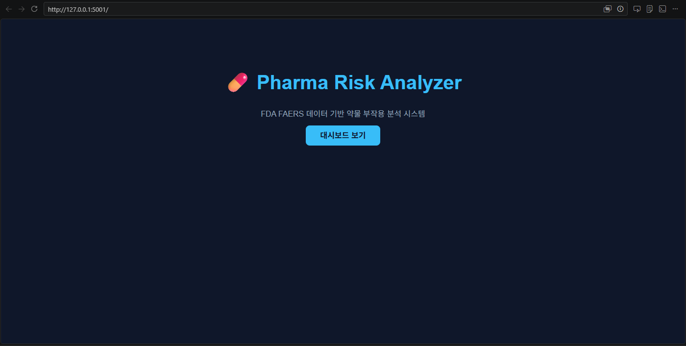
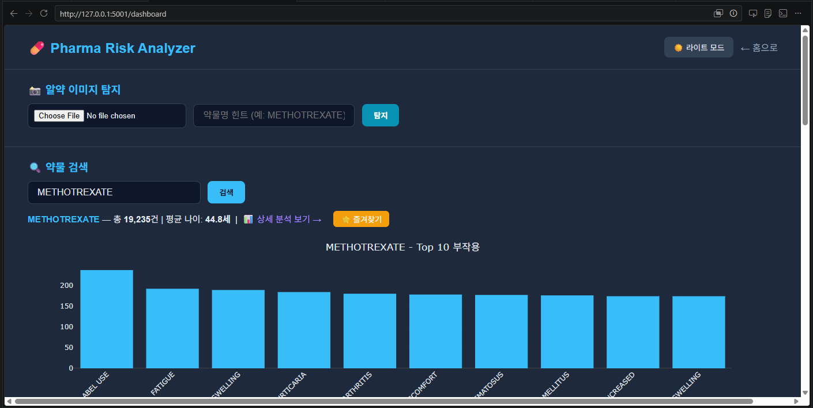
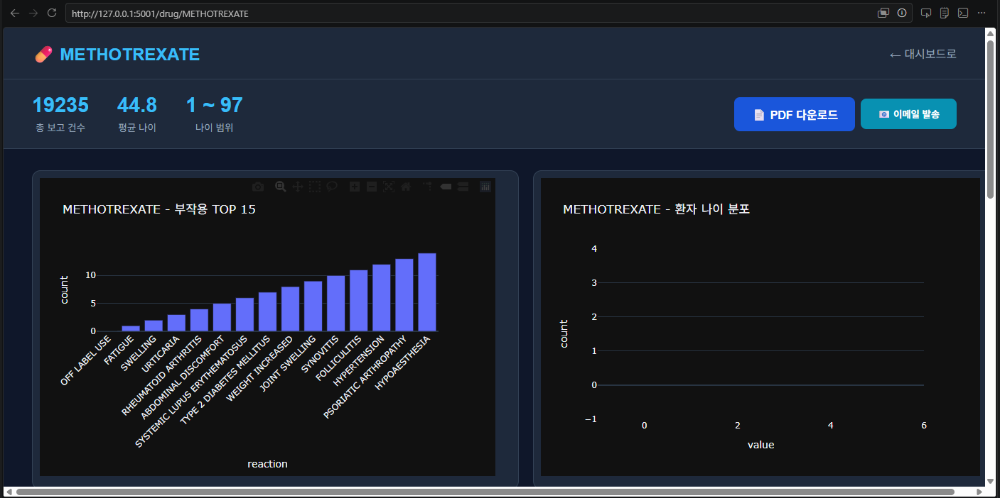
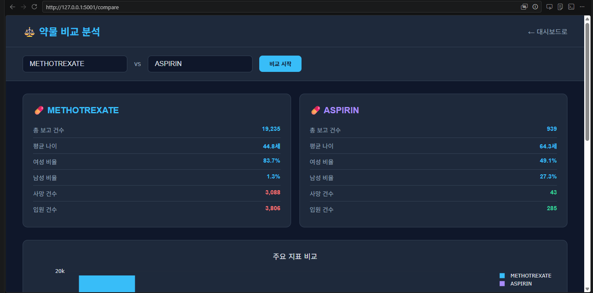

# 💊 Pharma Risk Analyzer
### 약물 부작용 AI 위험도 분석 시스템

> **AI-powered Drug Adverse Event Risk Analysis System**  
> FDA FAERS 실데이터 + YOLOv8 알약 탐지 + 머신러닝 위험도 예측

[](https://python.org)
[](https://flask.palletsprojects.com)
[](https://ultralytics.com)
[](https://www.fda.gov/drugs/questions-and-answers-fdas-adverse-event-reporting-system-faers)

---

## 📌 프로젝트 개요 | Overview

**한국어**  
FDA FAERS(Adverse Event Reporting System) 2024년 3분기 실데이터를 기반으로, 약물별 부작용 발생 패턴을 분석하고 머신러닝으로 위험도를 예측하는 웹 애플리케이션입니다. YOLOv8 기반 알약 이미지 탐지 기능과 한국 식약처 이상사례 데이터도 통합되어 있습니다.

**English**  
A web application that analyzes drug adverse event patterns and predicts risk levels using machine learning, based on real-world FDA FAERS 2024 Q3 data. Integrates YOLOv8-based pill image detection and Korean MFDS adverse event data.

---

## 🚀 주요 기능 | Key Features

| 기능 | 설명 | Feature |
|------|------|---------|
| 📊 대시보드 | FAERS 데이터 기반 부작용 통계 시각화 | Adverse event statistics dashboard |
| 🔍 약물 검색 | 약물명 자동완성 + 상세 부작용 분석 | Drug search with autocomplete |
| 🤖 AI 위험도 예측 | 약물·부작용·나이·성별 입력 → 위험도 분류 | ML-based risk prediction |
| 📸 알약 이미지 탐지 | YOLOv8으로 알약 종류 자동 인식 후 위험도 분석 | YOLOv8 pill detection + risk analysis |
| 📹 실시간 웹캠 탐지 | 웹캠으로 실시간 알약 탐지 | Real-time webcam pill detection |
| ⚖️ 약물 비교 | 두 약물의 부작용 패턴 나란히 비교 | Side-by-side drug comparison |
| 🔗 부작용 네트워크 | 약물-부작용 관계 네트워크 그래프 | Drug-reaction network graph |
| 📄 PDF 리포트 | 약물 분석 결과 PDF 자동 생성 | Automated PDF report generation |
| 🇰🇷 한국 데이터 | 식약처 이상사례 연도별 트렌드 분석 | Korean MFDS adverse event trends |
| 🔐 회원 기능 | 로그인·즐겨찾기·검색기록 관리 | User auth, favorites, history |

---

## 🛠️ 기술 스택 | Tech Stack

```
Backend   : Flask 3.1, SQLAlchemy, Flask-Login, Flask-Limiter
ML/AI     : scikit-learn (Random Forest), YOLOv8 (Ultralytics)
Data      : FDA FAERS 2024 Q3, 한국 식약처 이상사례 데이터
Viz       : Plotly, NetworkX
DB        : SQLite (개발), PyMySQL 지원
Report    : ReportLab (PDF 자동 생성)
Frontend  : Jinja2 Templates, Vanilla JS
```

---

## 📁 프로젝트 구조 | Project Structure

```
pharma-risk-analyzer/
├── app/
│   ├── __init__.py        # Flask 앱 팩토리, 확장 초기화
│   ├── models.py          # DB 모델 (User, DrugSearch, FavoriteDrug, PredictionLog)
│   ├── routes.py          # API 라우트 및 뷰
│   └── templates/         # HTML 템플릿
│       ├── dashboard.html
│       ├── drug_detail.html
│       ├── compare.html
│       ├── filter.html
│       ├── korea.html
│       ├── webcam.html
│       └── login/register.html
├── data/
│   ├── raw/
│   │   ├── faers_ascii_2024q3/   # FDA FAERS 원본 데이터
│   │   └── korea_adr.csv         # 한국 이상사례 데이터
│   ├── processed/
│   │   └── processed_faers.csv   # 전처리 완료 데이터
│   ├── download_faers.py         # FAERS 데이터 다운로드
│   └── preprocess.py             # 데이터 전처리
├── ml/
│   ├── train_model.py            # 분류 모델 학습
│   ├── train_yolo.py             # YOLOv8 파인튜닝
│   ├── model.pkl                 # 학습된 분류 모델
│   ├── le_drug.pkl / le_reac.pkl # 라벨 인코더
│   ├── risk_rates.pkl            # 사전 계산된 위험률
│   └── best.pt                   # YOLOv8 가중치
├── config.py                     # 앱 설정
└── run.py                        # 실행 진입점
```

---

## ⚙️ 설치 및 실행 | Installation & Run

```bash
# 1. 저장소 클론
git clone https://github.com/leesihwan21/pharma-risk-analyzer.git
cd pharma-risk-analyzer

# 2. 가상환경 생성 및 활성화
python -m venv venv
venv\Scripts\activate        # Windows
# source venv/bin/activate   # Mac/Linux

# 3. 패키지 설치
pip install -r requirements.txt

# 4. 환경변수 설정 (.env 파일 생성)
SECRET_KEY=your-secret-key
MAIL_USERNAME=your-email@gmail.com
MAIL_PASSWORD=your-app-password

# 5. 데이터 전처리 (최초 1회)
python data/preprocess.py

# 6. ML 모델 학습 (최초 1회)
python ml/train_model.py

# 7. 앱 실행
python run.py
```

브라우저에서 `http://127.0.0.1:5001` 접속

---

## 🧠 ML 모델 설명 | ML Model

**한국어**  
FDA FAERS 데이터에서 약물(drugname), 부작용(pt), 나이(age), 성별(sex), 사전 계산된 위험률(drug/reaction/combo risk rate) 7개 피처를 사용하여 해당 케이스가 입원·사망 등 중증 결과로 이어질지를 이진 분류합니다.

**English**  
Binary classification model predicting whether an adverse event case leads to serious outcomes (hospitalization/death), using 7 features: drug name, reaction type, age, sex, and pre-computed drug/reaction/combo risk rates from FAERS data.

```
Features  : drugname_enc, reaction_enc, sex_enc, age,
            drug_risk_rate, reac_risk_rate, combo_risk_rate
Target    : serious outcome (hospitalization/death = 1, other = 0)
Algorithm : Random Forest Classifier
Data      : FDA FAERS 2024 Q3 (real-world pharmacovigilance data)
```

---

## 📊 데이터 출처 | Data Sources

- **FDA FAERS 2024 Q3** : [FDA 공식 사이트](https://www.fda.gov/drugs/questions-and-answers-fdas-adverse-event-reporting-system-faers) — 실제 이상사례 자발적 보고 데이터
- **한국 식약처 이상사례** : 연도별(2019~2024) 증상 보고 통계

---

## 🖥️ 주요 화면 | Screenshots

**대시보드 | Dashboard**  


**약물 검색 결과 | Drug Search**  


**약물 상세 분석 | Drug Detail**  


**약물 비교 | Drug Comparison**  


---

## 📝 개발 배경 | Background

임상약학 석사 과정(아주대학교)과 AI 개발 교육(국비, MBC아카데미 수원) 과정에서 쌓은 생명과학·AI 역량을 결합하여, 실제 규제기관 데이터를 활용한 약물 안전성 분석 툴을 개발했습니다.

This project combines expertise in clinical pharmacy (M.S., Ajou University) and AI development training to build a practical drug safety analysis tool using real regulatory data from the FDA.

---

## ⚠️ 면책조항 | Disclaimer

본 도구는 연구·포트폴리오 목적으로 제작되었으며, 실제 임상적 의사결정에 사용해서는 안 됩니다.  
This tool is built for research and portfolio purposes only and should not be used for actual clinical decision-making.

---

## 👤 개발자 | Developer

**이시환 (Sihwan Lee)**  
GitHub: [@leesihwan21](https://github.com/leesihwan21)
